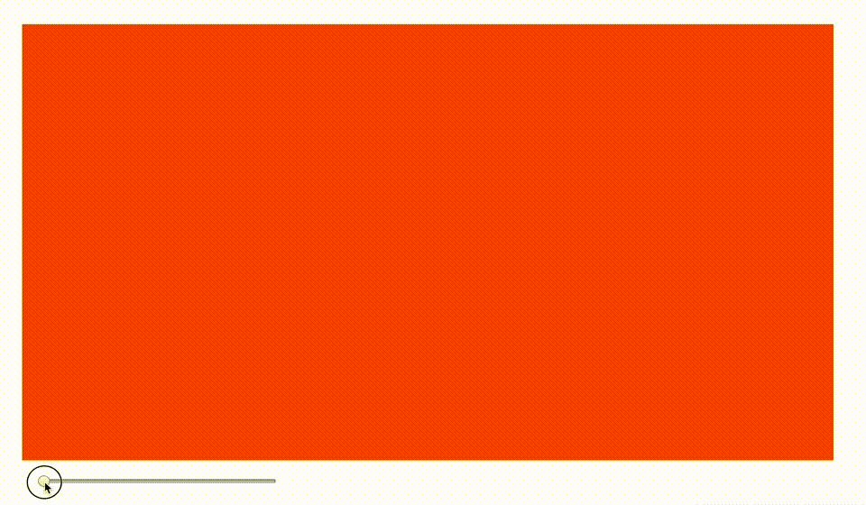

# Html CSS transform matrix3d 3D转场特效
## 透视矩阵

```
       2n/(r-l)    0      (r+l)/(r-l)    0
         0      2n/(t-b)  (t+b)/(t-b)    0
         0         0      (n+f)/(n-f) 2fn/(n-f)
         0         0          -1         0
```
t、b、l、r 分别代表camera投影面的上下左右，camera指向-z方向（指向屏幕内），n为近景距离，f为远景距离。

## Y轴旋转矩阵
```
            cos(θ)  0  sin(θ)  0
              0     1    0     0
           -sin(θ)  0  cos(θ)  0
              0     0    0     1
```

## 转场效果

主要步骤：  
```js
    let w = 1024;
    let h = 576;
    // 1/2宽作为近景在 X-O-Z 平面上，可以刚好使图像左右两边到camera的夹角为直角，
    // 且3个点组成的三角形为等腰直角三角形，便于后面计算。
    let n = -w / 2;
    let f = -w * 1000;

    let r = 1;
    let l = -1;
    let t = 1;
    let b = -1;

    let m00 = 2 * n / (r - l);
    let m02 = (r + l) / (r - l); //0
    let m11 = 2 * n / (t - b);
    let m12 = (t + b) / (t - b); //0
    let m22 = (n + f) / (n - f);
    let m23 = 2 * f * n / (n - f);
    let m32 = -1;

    const aperspect = math.matrix([
        [m00, 0, m02, 0],
        [0, m11, m12, 0],
        [0, 0, m22, m23],
        [0, 0, m32, 0]
    ])
    const aperspectT = math.transpose(aperspect);

    var change3d = (rfactor, dfactor, mSlide) => {
        //thet θ，图像距离近景越近，图像完全移出画布的角度越逼近于90度，越远越接近45度。
        let thet = 1 / 2 * rfactor * Math.PI;
        const rotationYT = math.matrix([
            [Math.cos(thet), 0, -Math.sin(thet), 0],
            [0, 1, 0, 0],
            [Math.sin(thet), 0, Math.cos(thet), 0],
            [0, 0, 0, 1]
        ])
        let result = math.identity(4);
        //把图像移动至原点(0, 0),方便计算绕Y轴旋转
        //若拉远至近景距离的2倍，视觉上为图像缩小1倍
        const transOT = math.matrix([
            [1, 0, 0, 0],
            [0, 1, 0, 0],
            [0, 0, 1, 0],
            [-w / 2, -h / 2, -w / 2 * dfactor, 1]
        ]);
        result = transOT;
        //y旋转
        result = math.multiply(result, rotationYT);
        //透视
        result = math.multiply(result, aperspectT);
        //还原至画布中央
        const transCenterT = math.matrix([
            [1, 0, 0, 0],
            [0, 1, 0, 0],
            [0, 0, 1, 0],
            [w / 2, h / 2, 0, 1]
        ]);
        result = math.multiply(result, transCenterT);
        let mStr = math.flatten(result)._data.join(',');
        mSlide.style.transform = `matrix3d(${mStr})`
    }
```
另外 CSS transform matrix3d 的值为列向量计算矩阵的转置，上面全部使用转置矩阵来计算。  
```js
   matrix3d( 
       a1, b1, c1, d1, 
       a2, b2, c2, d2, 
       a3, b3, c3, d3, 
       a4, b4, c4, d4)
```
[DEMO 地址](https://github.com/gaobowen/web-code-snippets/effect/3dmatrix.html)

参考文献：  
1. [3D游戏与计算机图形学中的数学方法-视截体](https://www.cnblogs.com/tgycoder/p/4889225.html)  
2. [透视投影矩阵推导](https://www.cnblogs.com/AirGuanZ/p/6365702.html)  
3. [旋转矩阵](https://www.cnblogs.com/zhoug2020/p/7842808.html)