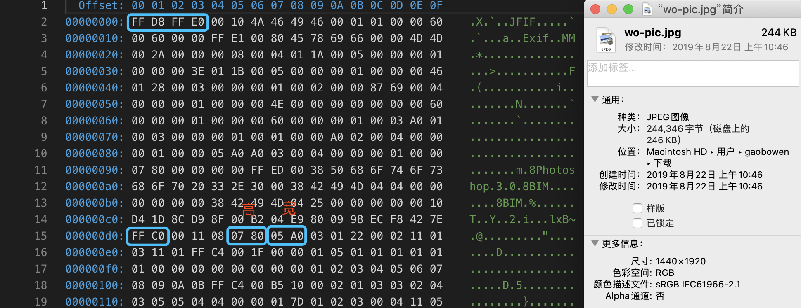
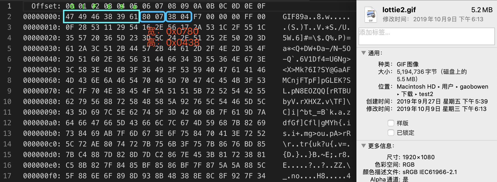
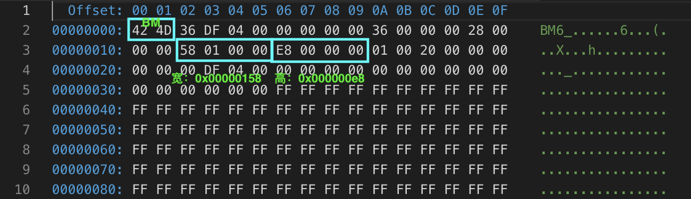

# 前端 JS 获取 Image 图像 宽高 尺寸
## 简介
项目中用到获取图片的原始尺寸，然后适配宽高；网上的大部分前端解决方案，都是new Image()后,在onload事件中获取image的尺寸。  
在图片数量较多的时候，这样的获取效率实在是低下。所有就有了这篇文章。通过直接读取解析文件的字节码来获取图片的尺寸。

## PNG

```js
function ReadPNG(bytes) {
    if (bytes.slice(0, 8).toString() === IMAGE_HEAD_SIGS.PNG.toString()) {
        let width = readUint32BE(bytes, 16);
        let height = readUint32BE(bytes, 20);
        return { width, height }
    }
}
```

## JPG

```js
function ReadJPG(bytes) {
    if (bytes.slice(0, 4).toString() === IMAGE_HEAD_SIGS.JPG.toString()) { 
        const M_SOF0 = 0xC0; /* Start Of Frame N */
        const M_SOF1 = 0xC1; /* N indicates which compression process */
        const M_SOF2 = 0xC2; /* Only SOF0-SOF2 are now in common use */
        const M_SOF3 = 0xC3;
        const M_SOF5 = 0xC5; /* NB: codes C4 and CC are NOT SOF markers */
        const M_SOF6 = 0xC6;
        const M_SOF7 = 0xC7;
        const M_SOF9 = 0xC9;
        const M_SOF10 = 0xCA;
        const M_SOF11 = 0xCB;
        const M_SOF13 = 0xCD;
        const M_SOF14 = 0xCE;
        const M_SOF15 = 0xCF;
        for (let i = 0; i < bytes.length; i++) {
            if (bytes[i] === 0xFF) {
                switch (bytes[i + 1]) {
                    case M_SOF0:
                    case M_SOF1:
                    case M_SOF2:
                    case M_SOF3:
                    case M_SOF5:
                    case M_SOF6:
                    case M_SOF7:
                    case M_SOF9:
                    case M_SOF10:
                    case M_SOF11:
                    case M_SOF13:
                    case M_SOF14:
                    case M_SOF15:
                        {
                            //高在前，宽在后。
                            let width = readUint16BE(bytes, i + 7)
                            let height = readUint16BE(bytes, i + 5)
                            return { width, height }
                        }
                    default:
                        break;
                }
            }
        }
    }
}
```

## GIF

```js
function ReadGIF(bytes) {
    if (bytes.slice(0, 3).toString() === IMAGE_HEAD_SIGS.GIF.toString()) {
        let width = readUint16LE(bytes, 6);
        let height = readUint16LE(bytes, 8);
        return { width, height }
    }
}
```

## BMP

```js
function ReadBMP(bytes) {
    if (bytes.slice(0, 2).toString() === IMAGE_HEAD_SIGS.BMP.toString()) {
        //虽然格式为4字节，这里只取2字节，确保height为正数。为负数时，图像为倒置图像。
        let height = readUint16LE(bytes, 22);
        let width = readUint16LE(bytes, 18);
        return { width, height }
    }
}
```
## NPM
```bash
npm i image-dimensionj
```
[NPM地址](https://www.npmjs.com/package/image-dimensionjs)  
[项目地址](https://github.com/gaobowen/image-dimension)